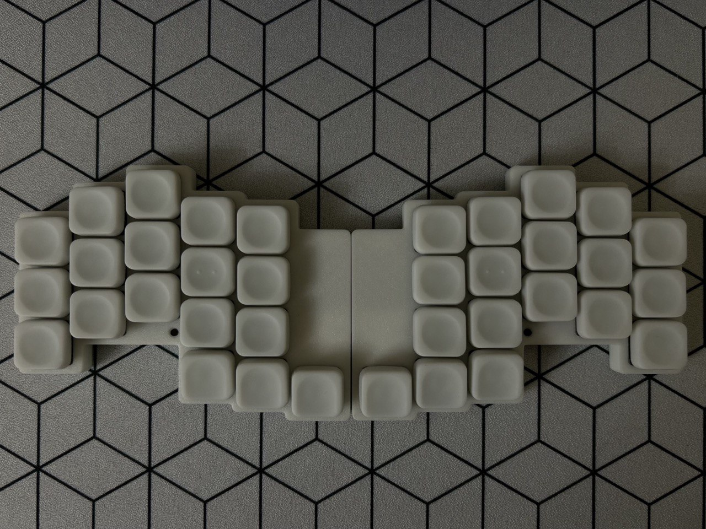
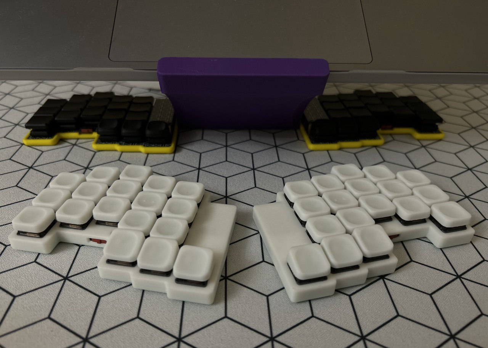
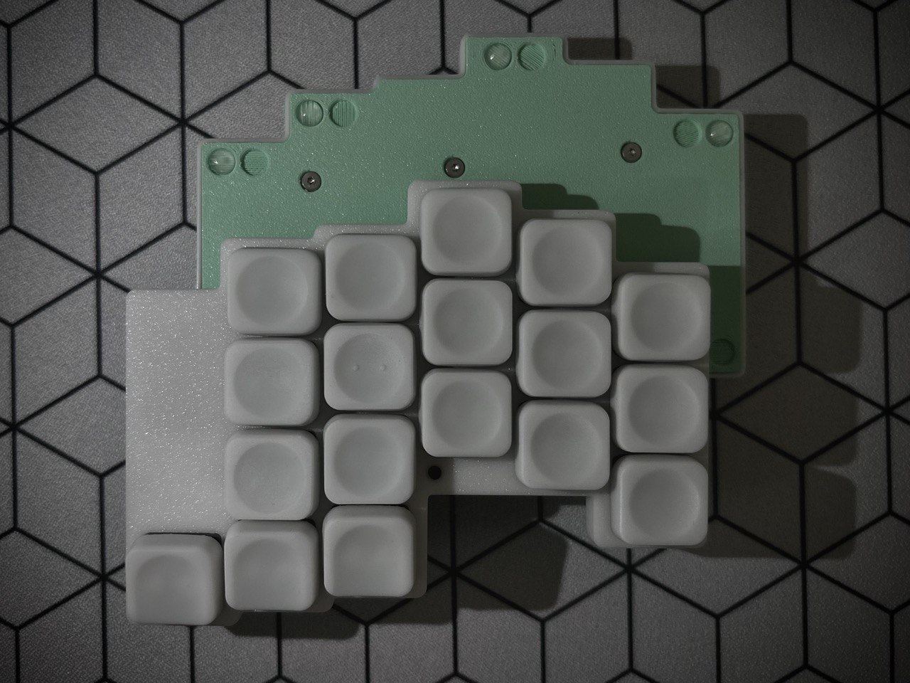
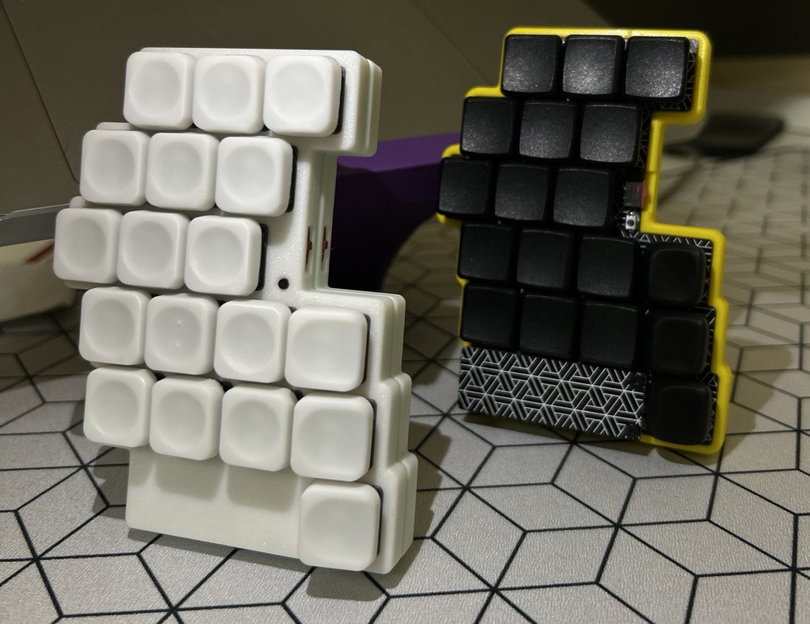

```
 _____ _____ _____     _____ _____ _____ _____ _____ _____
|__   |     |  |  |___|     |     |   | |   __|     |   __|
|   __| | | |    -|___|   --|  |  | | | |   __|-   -|  |  |
|_____|_|_|_|__|__|   |_____|_____|_|___|__|  |_____|_____|

```

# ZMK hEnki Keyboard

This is a ZMK configuration for the hEnki keyboard.

Link to project: [zmk-config-hEnki](https://github.com/brandonhutchison/zmk-config-hEnki)

## Photo



---


---



---



---


